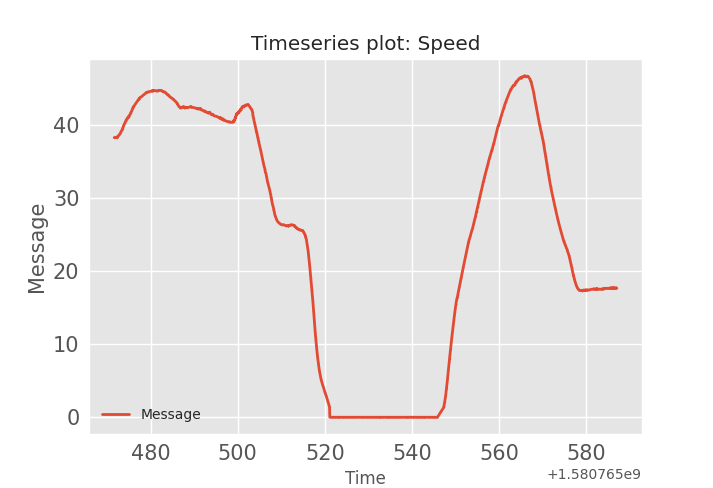
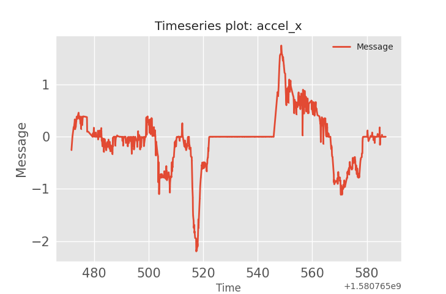

## Longitudinal acceleration: message id=552

The following plots were generated using the [strym](https://github.com/jmscslgroup/strym) package that is used to decode, visualize, and analyse CAN bus messages.  
The goal here is to verify that the message with id 552 provides the longitudinal acceleration. The csv file contains raw CAN bus messages of some drive.

### Speed plot:
--- 
The following figure shows speed message plotted.
 

---

### : Longitudinal acceleration plot:
---
The following figure show the longitudinal acceleration (in the x-direction).

---

### Intergration of the acceleration message:
---
Using the integration function implemented in [strym](https://github.com/jmscslgroup/strym) package, we plotted the acceleration signal after integration. As seen in the figure, the integration of the accelearion signal gave us back the speed graph, and as a result we are confident that message 552 reports the accelation of the vehicle.

---