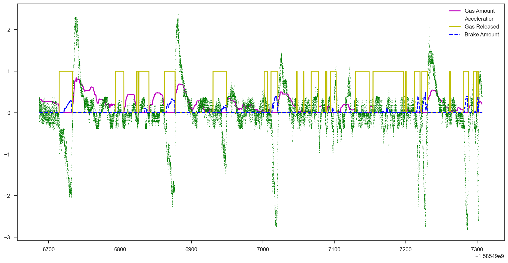

## Accelerator: message id=705

Plots for the accelerator show when the gas pedal is pressed, and by how much.

### Plotting Accelerator Proportion:
---
This plot was created by using message id 705. 
 

---

### Plotting Accelerator Released:
---
This plot uses the same message id, and shows when the pedal was totally released (foot off the pedal).

---

### See both combined:
---
Here they are overlaid to see how they go together, and then with the longitudinal acceleration and brakes added showing how the accelerator data lines up as it should. Notice how large spikes in acceleration coincide with the large bumps in accelerator being depressed. Notice also how when there are large decelerations the pedal is released (when the brake is pressed), and other times it's clear the driver is just coasting. There are lots of evironmental factors that affect acceleration and accelerator use such as traffic density, speed limit, and road grade that aren't shown here, but this is still a convincing set of plots.

---
