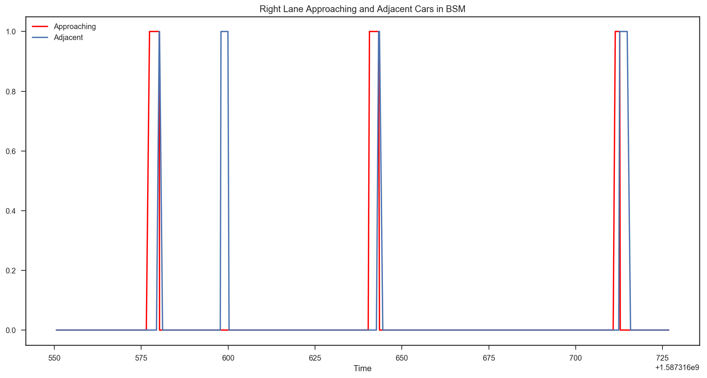
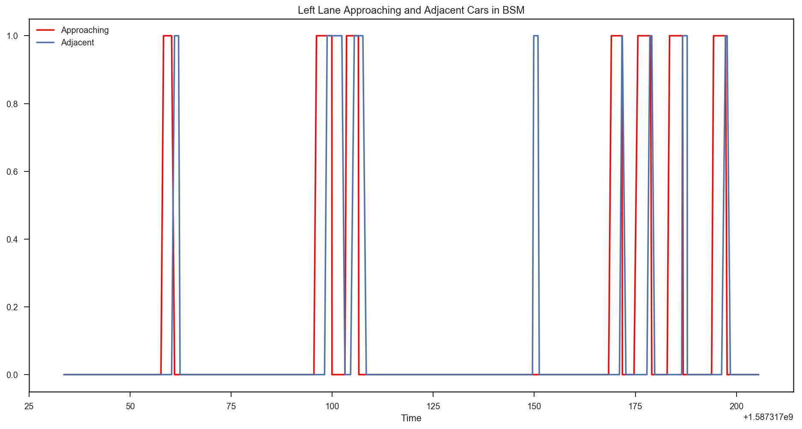

## Blind Spot Monitor

### The BSM indicates a binary state of whether there is a car adjacent or approaching on both the left and right sides. In this directory lives segments of a dash cam video, and plots of the CAN message from post-processing to demonstrate our confidence in the values derived from our DBC.

The BSM_right plots and video are for the right lane signals. The plots show the first approaching and adjacent car (in video we see it passing) at timestamps 15:16:17-20 and 15:16:20 respectively, and the second isn't recorded as approaching but is adjacent at 15:16:38.

We can confirm both of these in the video.

[Video Link](https://youtu.be/FACmYOg_Ixg)

The reason why the BSM doesn't report the second car as approaching is because its relative velocity is so low. Makes sense, to avoid a false positive of an approaching vehicle. Additionally, this is the exception; the vast majority of the time, the car is recognized as approaching before adjacent.

[BSM](right_18wheeler_bsm.png)
!

Another peculiarity -- two segments of approaching vehicles in the plot above, but on extended adjacent vehicle segment. That's when a tractor trailer passed, makes sense especially when you see the shape of the trailer! Plots show approaches at 15:25:43, 15:25:50 and adjacent at 15:25:46.  
You can confirm this in the [18 wheeler video](https://youtu.be/VOQVzmjUqKA). 

In the 18 wheeler video, a car also passes on the left (plots below indicate at 15:25:49).Both the right side and left side BSM signals are accurate.

