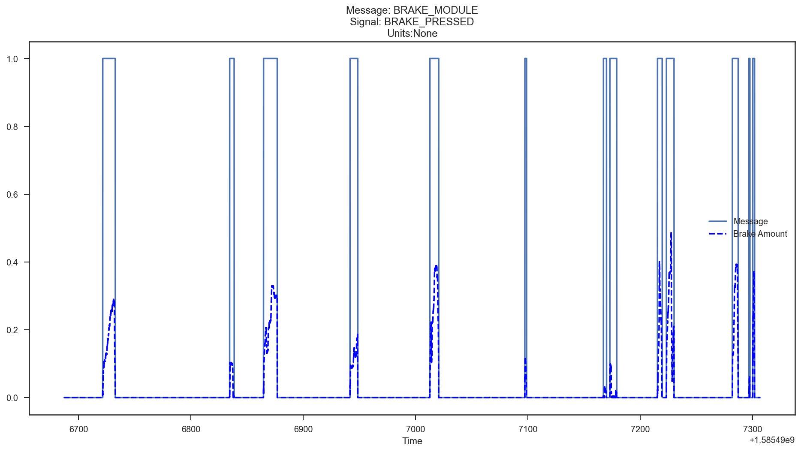
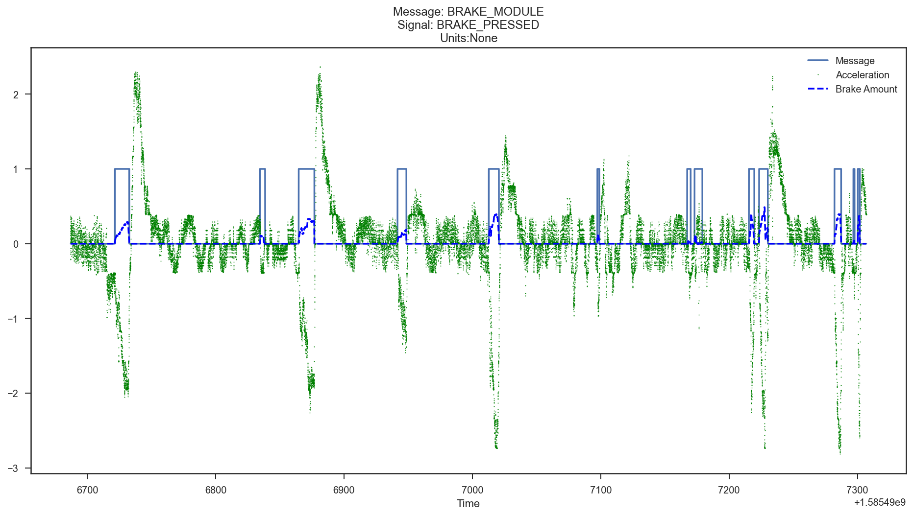
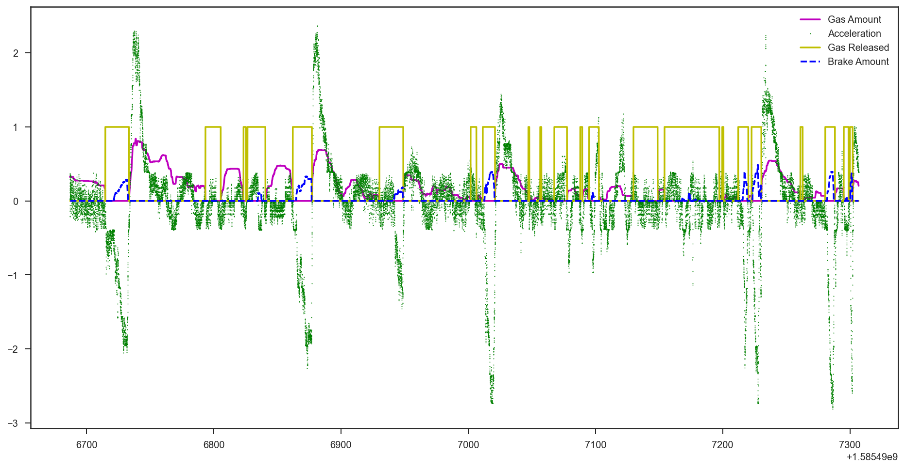

### The Brake Pedal
The brake proportion and the binary brake pressed signals are clear and clearly useful in understanding the trajectory of a vehicle and the driver's behavior.

### Brake Usage
Here is the use of the brakes on a drive:

Here is that brake use in context with the accelerometer signal:

When the brakes are engaged, there is clear deceleration -- as would be expected from brakes.

Finally, here is a plot showing the gas pedal proportion, binary gas pedal pressed singal, and acceleration, along with the brake signal.It further shows the intuitive relationship between brakes, accelerator (gas pedal), and acceleration.

### Live Brake Use in Video
This video shows the live signal of the brake sensor as it is being pushed and releasd.

