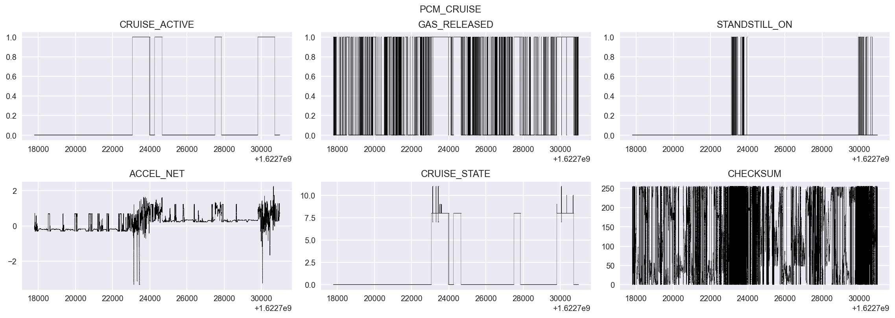
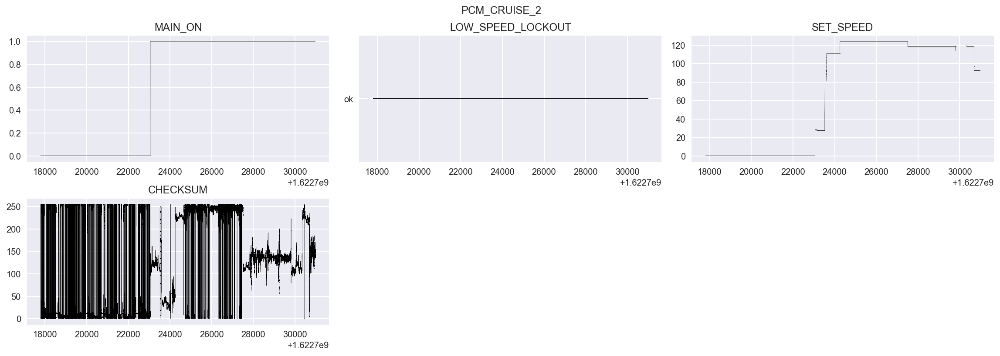

## Cruise Control Information

The purpose of this directory is to show our confidence in the cruise control related values decoded using our dbc file.
This directory contains...
The csv file contains a raw CAN bus messages, and it was recorded under the following conditions:
+ The vehicle is stationary.
+ Start recording a video for the dashboard
+ Start recording CAN data
+ Press the gas pedal and set the engine speed to 1000rpm and increase it to 4000rpm. Then release the gas pedal.
+ Stop CAN recording.
+ Verify CAN data recording saved.
+ Stop video

### Plotted Data:
---
The plot below shows the Cruise Active message, whiche shows when the cruise control system is activated. Compare this to the Cruise State message where we can see when there are faults or state changes in the cruise control system. The active state is 8, if standstill is requested it will switch to state 11(3 sec timer), after the timer is elapsed it will switch into state 7(standstill). If plus button was pressed - status 9, minus button pressed - status 10. You can tell in this trip that there were a number of times that cruise was active and enabled, but in a standstill. This is reflected in the CRUISE_STATE msg and also in the STANDSTILL_ON binary msg. ACCEL_NET shows the net acceleration from the cruise system in the car including input from given ACCEL_CMD, road grade, and other factors. GAS_RELEASED is a binary signal that shows when the driver's foot is off of the gas pedal.

The next plot shows the signal indicating when the main cruise control system is on (radar cruise active, basically). Critically, this msg also has a signal for the SET_SPEED in kph. This is the input that the cruise system uses to actuate to the desired speed. The HUD has the driver set their speed in MPH, but at the lower level everything is done in metric.

---
