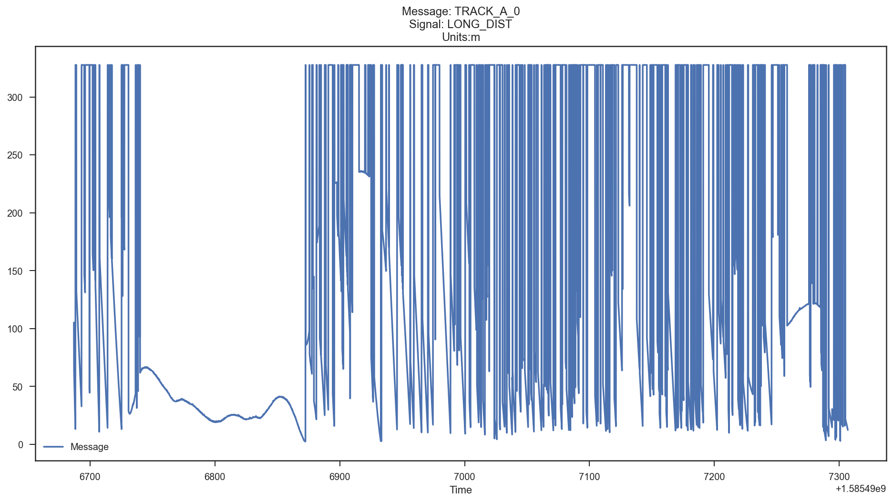
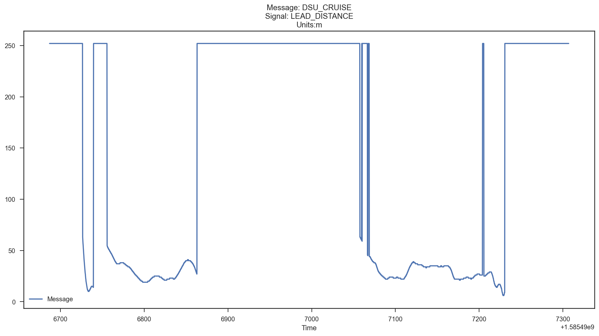

### Lead Distance Measures
#### Raw Radar

There are multiple sources of radar-derived information on the CAN bus. First, there is a set of 16 signals that look somewhat like this:

There are sections with clear and smooth signals, lots of measurements that look like noise, and a large number of measurement values at a precise number 300+. When there are clear sections of a signal, that is when the radar sensor has a track locked on an object (not necessarily the lead vehicle). When there is no measurement, the 300+ value is reported; this is because in CAN runs on a synchronous transmission model that requires values to be reported.
#### Processed Radar
By combining radar measurements, Toyota creates a message that reports the distance to the lead vehicle reported in another CANID. It loses some precision and has increased latency, but is still accurate a pretty strong true positive. When it doesn't have a lock on the lead vehicle, i.e. when there is no lead vehicle, this message reports 252:

You can see a section in the first half that is the same as the Track 1 raw radar above, but it differs later when other tracks are tracking the lead vehicle.

#### Live Radar Measurement of Lead Object
This video shows the radar sensor points and Lead Distance signal on a live plot when pulling in and out of a parking spot.

In the video, it's evident that the processed 869 signal is a rounded floor of the true state. I.e. it will output 5 meters distance for 5.9 meters or 5.1 meters of true distance. For many applications, even likely the stock ACC system on the Toyota vehicle, this rounding is close enough. Using hybrid techniques that leverage Kalman filtering and clustering algorithms, we can get the reliability of the Processed Radar with the precision that meets or exceeds the raw radar data for the position of the lead vehicle.
