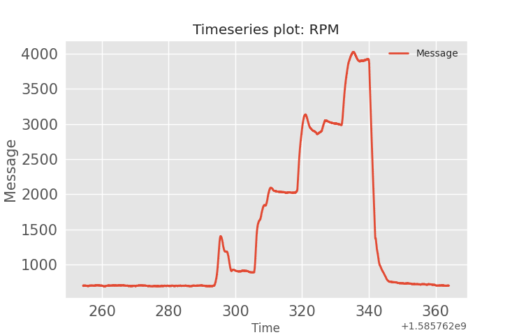

## RPM: message id=452

The purpose of this directory is to show our confidence in the RPM values decoded using our dbc file.
This directory contains video of a dash cam and an animated plot of RPM CAN message.
The csv file contains a raw CAN bus messages, and it was recorded under the following conditions:
+ The vehicle is stationary. 
+ Start recording a video for the dashboard
+ Start recording CAN data
+ Press the gas pedal and set the engine speed to 1000rpm and increase it to 4000rpm. Then release the gas pedal.
+ Stop CAN recording.
+ Verify CAN data recording saved.
+ Stop video

### Plotted Data:
---
The following plot was generated using the [strym](https://github.com/jmscslgroup/strym) package that is used to decode, visualize, and analyse CAN bus messages. 

---
### Test video:
---
A video for the conducted test is in the following link.

---

