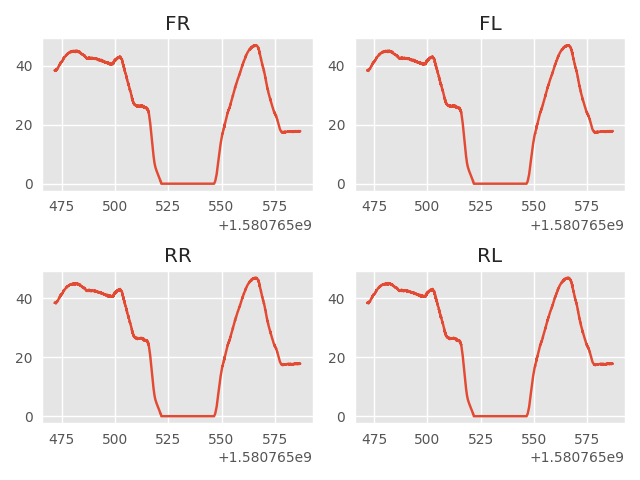
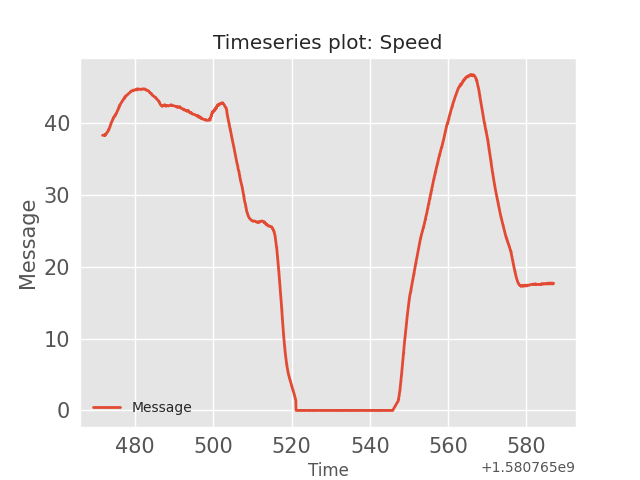

## Longitudinal Speed: message id=180

The following plots were generated using the [strym](https://github.com/jmscslgroup/strym) package that is used to decode CAN bus messages.

### Plotting Speed:
---
 

---

### Plotting Speed for each wheel:
---

---

### Plotting Speed from Driving Support Unit (DSU):
---

---