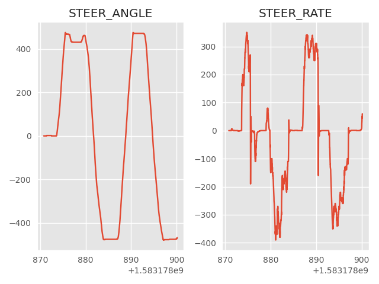
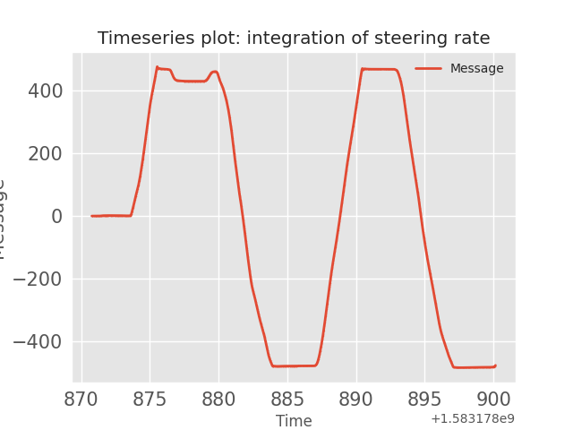
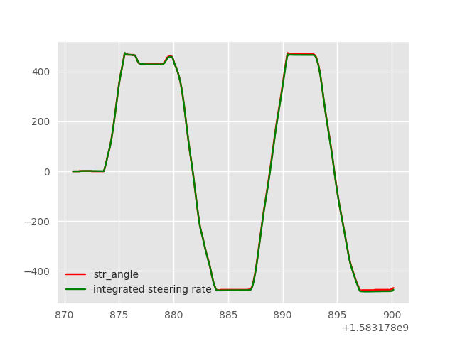

## Steering Angle: message id=37

The following plots were generated using the [strym](https://github.com/jmscslgroup/strym) package that is used to decode, visualize, and analyse CAN bus messages.  

The goal here is to verify that the message with id 180 provides the vehicle's speed information.  In order to do that, we plotted the speed of each wheel using message id 170 and the speed from Driving Support Unit (DSU) which gives longitudinal motion using message id 353. These two plots verify that message 180 is indeed reporting speed information.

### Speering angle and steering rate:
--- 
 

---

### Integration of steering rate:
---

---

### Speering angle and the integrated steering rate:
---

---